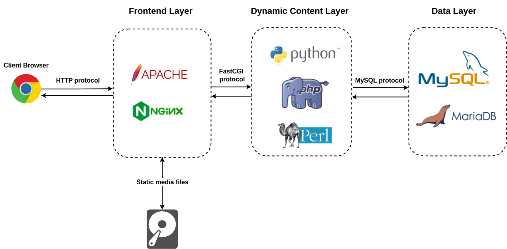

# LAMP stack based on Amazon Linux 2023

The **LAMP stack** is a popular open-source software stack used for developing and deploying web applications. The acronym **LAMP** stands for:

1. **L**inux - The operating system that serves as the foundation of the stack. It provides the environment to run the other components.
2. **A**pache - The web server that handles HTTP requests and serves web pages to users.
3. **M**ySQL (or MariaDB) - The database management system used to store and retrieve application data.
4. **P**HP (or Perl/Python) - The scripting language used to develop dynamic web applications.



### How LAMP Works:
1. **User requests a webpage** --> Apache processes the request.
2. **Apache interacts with PHP** --> If the page contains PHP code, Apache hands it to the PHP interpreter.
3. **PHP queries the MySQL database** --> Retrieves data needed for dynamic content.
4. **Response is generated** --> The PHP script processes the data and sends HTML to the user's browser.

### Why Use LAMP?
- Open-source and cost-effective.
- Reliable, flexible, and widely supported by open-source community.
- Ideal for hosting from small to mid-sized dynamic websites and web applications.

### Build and verify AMI

To build AMI with LAMP stack installed:
```bash
packer build main.pkr.hcl
```

For verification purposes, create the file with PHP info. Connect to the EC2 via Instance Connect and run the following:
```bash
echo "<?php phpinfo(); ?>" > /var/www/html/phpinfo.php
```

**NOTE**  
After verification, delete the PHP info file from server.

To verify if AMI was properly configured, launch EC2 instance with built AMI and access the Public DNS name of the EC2 instance:
```bash
http://ec2-34-238-116-10.compute-1.amazonaws.com/phpinfo.php
````

**NOTE**  
Don't forget to enable inbound traffic on port 80 for the EC2 instance.

When accessing the DNS name you should see the PHP info for your server:


### References:
- [AWS Tutorial: Install a LAMP server on AL2023](https://docs.aws.amazon.com/linux/al2023/ug/ec2-lamp-amazon-linux-2023.html)
